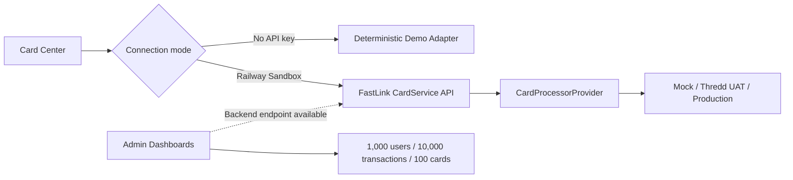

# FastLink Sprint-06 — Card Center & Admin Acceptance

## Scope

- Card Center: virtual/physical card creation, card detail, freeze/unfreeze, balance, PIN, CVV and card transactions.
- Admin: Treasury, Settlement, Risk, Card, Transaction and Webhook dashboards.
- Every dashboard supports search, status/currency filtering and CSV export.
- Deterministic browser-safe demo data: 1,000 users, 10,000 transactions, 100 cards and six asset currencies.
- Superseded in Sprint-13 Phase-3: the legacy platform credential was removed and replaced by revocable administrator sessions.

## Adapter behaviour



The UI remains operable in Demo mode. When an Admin API key and Sandbox tenant are selected, supported card lifecycle actions are routed to the canonical FastLink APIs. PIN/CVV failures from a non-CardSandbox card are presented as feature availability messages rather than breaking the page.

## API contracts used

- `POST /api/cards` (`cardType`: `VIRTUAL` or `PHYSICAL`)
- `GET /api/cards/{id}`
- `POST /api/cards/freeze`
- `POST /api/cards/unfreeze`
- `GET /api/cards/balance`
- `POST /api/admin/tenants/{tenantId}/card-sandbox/cards/{cardId}/pin`
- `GET /api/admin/tenants/{tenantId}/card-sandbox/cards/{cardId}/cvv`

## Verification

```bash
npm test
npm run build
```

Expected test result:

```text
Sprint-06 demo verification passed: 1,000 users · 10,000 transactions · 100 cards · multi-currency · CSV safety
```

## UI acceptance path

1. Sign in as `Platform Super Admin`.
2. Open `Card Center` from the left navigation.
3. Create both a `VIRTUAL` and `PHYSICAL` demo card, select a card and test freeze/unfreeze, balance, PIN and CVV controls.
4. Open `业务运营看板`.
5. Switch through all six dashboard tabs, apply search/status/currency filters and export a CSV.

## Security notes

- Superseded in Sprint-13 Phase-3: browser-persisted administrator credentials are prohibited.
- CVV is displayed for at most 30 seconds and is never persisted.
- PIN input is masked, validated as four digits and cleared immediately after use.
- CSV cells beginning with `=`, `+`, `-` or `@` are neutralized to prevent spreadsheet formula injection.
