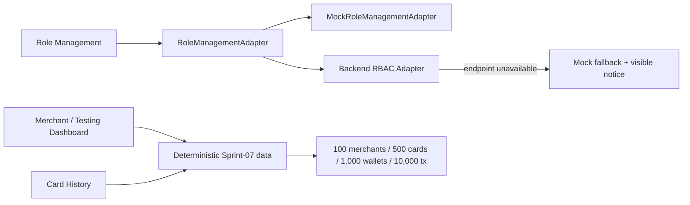

# FastLink Sprint-07 — Role, Merchant & Card History Acceptance

## Delivered pages

### Role Management

- Search roles by ID, name or scope.
- Filter by scope and status.
- Permission matrix covering Tenant, Wallet, Cards, Treasury, Risk, Merchants, Webhooks and Audit.
- Create roles with least-privilege defaults and enable/disable non-protected roles.
- `Platform Super Admin` remains protected and cannot be downgraded in the UI.
- `MockRoleManagementAdapter` and resilient Backend Adapter are isolated behind `RoleManagementAdapter`.
- If `/api/admin/rbac/*` is not deployed, the adapter displays a feature notice and safely falls back to Mock without changing the existing navigation RBAC.

### Merchant / Testing Dashboard

- Exactly 100 merchants.
- Exactly 500 virtual/physical cards.
- Exactly 1,000 wallets.
- Exactly 10,000 merchant transactions.
- USD, EUR, GBP, MYR, SGD and USDT test assets.
- Merchant, Card, Wallet and Transaction tabs with search, status/currency filters and CSV export.

### Card History

- First-level sidebar entry for direct access.
- 2,500 deterministic lifecycle audit events covering create, activate, freeze, unfreeze, balance, PIN and CVV actions.
- Search, event/actor filtering and CSV export.
- PIN and CVV values are never included in history or exports.

## Frontend adapter architecture



## Security

- Superseded in Sprint-13 Phase-3: administrator authentication uses revocable user sessions held only in memory.
- No Client ID, SSA, certificate, private key, CVV or PIN is stored in source or demo data.
- Existing role-to-navigation boundaries remain in `App.tsx` and are not replaced by untrusted Mock data.
- Superseded in Sprint-13 Phase-3: backend RBAC writes require an authenticated user Bearer session and database permission.

## Verification commands

```bash
npm test
npm run build
```

Expected Sprint-07 test output:

```text
Sprint-07 verification passed: Role Adapter · 100 merchants · 500 cards · 1,000 wallets · 10,000 transactions · Card History
```

## Visual acceptance path

1. Login as `Platform Super Admin`.
2. Select `Role Management` from the sidebar. Search/filter roles, create a Sandbox role and toggle a permission.
3. Select `Merchant / Testing`. Verify all four acceptance counters, switch tabs, filter and export CSV.
4. Select `Card History`. Search for a Card ID and filter `FROZEN`, `PIN_UPDATED` or `CVV_REVEALED` events.
